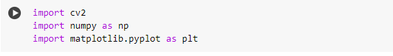
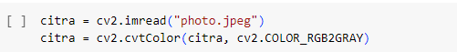
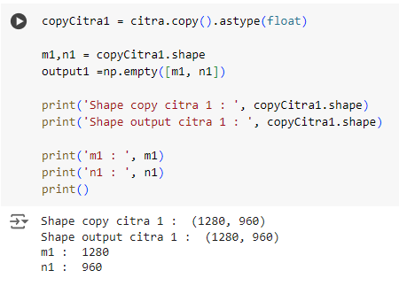
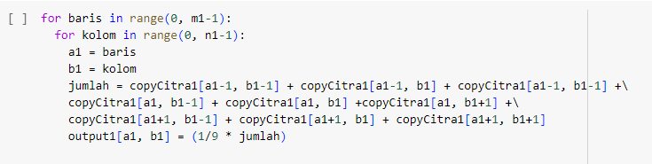
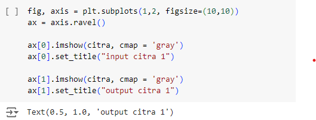
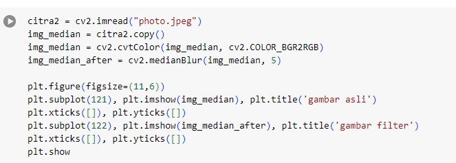
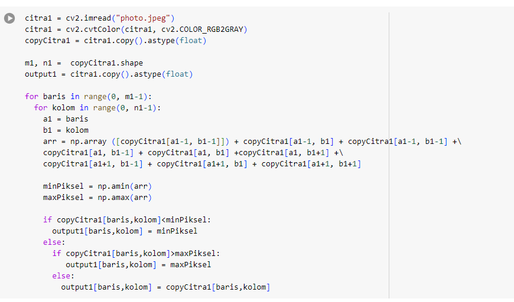
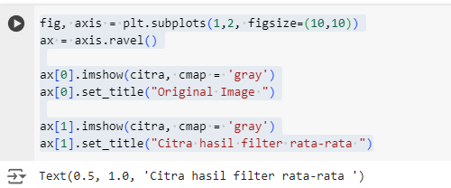
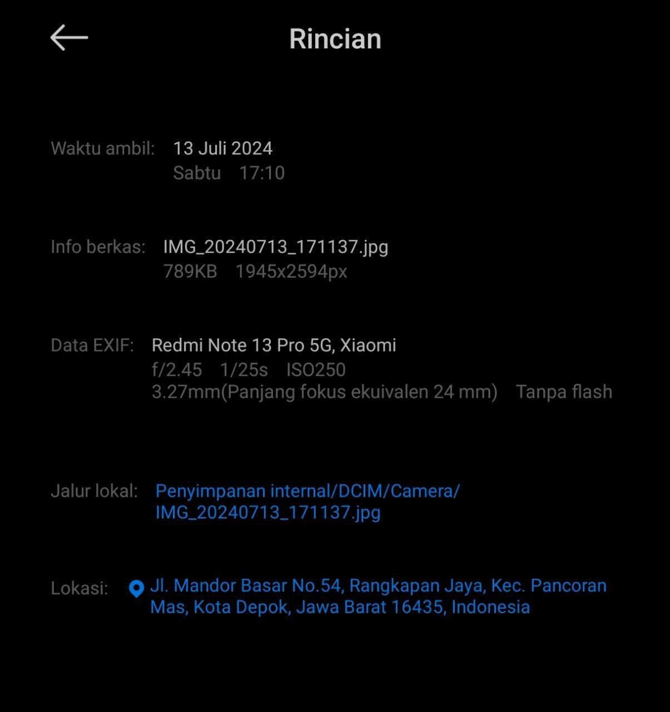

# Filtering

**Teori yang Mendukung Mengenai Proyek**

Proyek ini bertujuan untuk menerapkan filter rata-rata (mean filter) dan filter median pada citra menggunakan Python dan library OpenCV. Filter ini sangat berguna dalam pengolahan citra untuk mengurangi noise atau gangguan pada gambar.

**Filter Rata-rata (Mean Filter)**

Filter rata-rata adalah teknik paling sederhana di dunia pengolahan citra. Cara kerjanya cukup straightforward: setiap piksel pada gambar diolah dengan cara mengambil rata-rata intensitas piksel di sekitarnya. Ini membantu menghasilkan gambar yang lebih halus dengan meratakan perbedaan intensitas antar piksel tetangga.

**Filter Median**

Sedangkan filter median, ini lebih ke teknik jagoan yang non-linear. Filter ini menggunakan nilai median dari intensitas piksel di sekitarnya. Dengan begitu, filter median efektif mengurangi noise seperti titik-titik putih dan hitam tanpa harus mengorbankan detail-detail penting pada gambar.

# Tahapan Cara Menyelesaikan Proyek Secara Rinci
**1. Import Library** 

**import cv2**: Library OpenCV untuk pengolahan citra dan penglihatan komputer.

**import numpy as np**: Library NumPy untuk komputasi numerik dengan struktur data array.

**import matplotlib.pyplot as plt**: Modul Matplotlib untuk membuat visualisasi grafis dalam Python.

**Membaca citra, citra yang digunakan adalah citra *photo* yang memiliki noise berupa bintik-bintik. Unduh dataset pada tautan berikut**

Kode ini membaca gambar dengan nama file **"photo.jpeg"** menggunakan OpenCV (cv2.imread) dan kemudian mengubahnya menjadi citra grayscale menggunakan fungsi **cv2.cvtColor** dengan parameter **cv2.COLOR_RGB2GRAY**.

**cv2.imread("photo.jpeg")**: Fungsi ini membaca gambar dari file "photo.jpeg" dan menyimpannya dalam variabel citra. Gambar ini dibaca dalam format **BGR (Blue-Green-Red)** oleh OpenCV secara default.

**cv2.cvtColor(citra, cv2.COLOR_RGB2GRAY)**: Fungsi ini mengonversi gambar yang telah dibaca (citra) dari format BGR ke grayscale. Parameter **cv2.COLOR_RGB2GRAY** menentukan konversi warna dari RGB (Red-Green-Blue) ke grayscale.

Dengan demikian, setelah dua baris kode ini dieksekusi, citra akan berisi representasi grayscale dari gambar yang dibaca dari file **"photo.jpeg"**.

**Menyalin citra ke variabel khusus dan melihat atribut citra berupa jumlah baris dan kolom**

**copyCitra1 = citra.copy().astype(float)**: Membuat salinan citra dalam format float untuk operasi matematis.

**m1, n1 = copyCitra1.shape**: Mengambil dimensi citra salinan (copyCitra1), yaitu jumlah baris (m1) dan kolom (n1).

**output1 = np.empty([m1, n1])**: Membuat array kosong untuk menyimpan hasil operasi selanjutnya.

**print('Shape copy citra 1 : ', copyCitra1.shape)**: Cetak bentuk citra salinan (copyCitra1).

**print('m1 : ', m1)**: Cetak jumlah baris (m1) citra salinan.

**print('n1 : ', n1)**: Cetak jumlah kolom (n1) citra salinan.

**Membuat filter mean**

Kode ini merupakan implementasi dari filter rata-rata (mean filter) yang diterapkan pada citra grayscale copyCitra1. Filter ini bekerja dengan mengambil rata-rata intensitas piksel di sekitar setiap piksel dalam citra.

Penjelasan singkatnya:

**for baris in range(0, m1-1):**: Melakukan iterasi untuk setiap baris dalam citra salinan, kecuali baris terakhir.

**for kolom in range(0, n1-1):**: Melakukan iterasi untuk setiap kolom dalam citra salinan, kecuali kolom terakhir.

**a1 = baris dan b1 = kolom**: Menyimpan indeks baris dan kolom saat ini untuk digunakan dalam perhitungan.

**jumlah = ...**: Menghitung jumlah intensitas piksel di sekitar piksel saat ini, sesuai dengan kernel 3x3.

**output1[a1, b1] = (1/9 * jumlah)**: Menyimpan nilai rata-rata dari intensitas piksel yang dihitung ke dalam citra output (output1) pada posisi yang sesuai.

Filter rata-rata ini membantu menghaluskan citra dengan cara mengurangi perbedaan intensitas yang tajam antara piksel-piksel tetangga.

Kode ini bertujuan untuk menampilkan dua gambar secara bersamaan dalam satu jendela plot menggunakan Matplotlib. Berikut penjelasannya:

**fig, axis = plt.subplots(1,2, figsize=(10,10))**: Ini membuat sebuah figure (fig) dengan dua subplot (axis) sejajar (1 baris, 2 kolom) dengan ukuran total 10x10 inci.

**ax = axis.ravel()**: Mengubah array dari objek subplot (axis) menjadi array 1 dimensi menggunakan .ravel(), sehingga kita bisa mengakses setiap subplot secara individual.

**ax[0].imshow(citra, cmap='gray')**: Menampilkan citra dalam subplot pertama (ax[0]) dengan menggunakan colormap grayscale (cmap='gray').

**ax[0].set_title("input citra 1")**: Menambahkan judul "input citra 1" pada subplot pertama.

**ax[1].imshow(citra, cmap='gray')**: Menampilkan citra dalam subplot kedua (ax[1]) dengan menggunakan colormap grayscale.

**ax[1].set_title("output citra 1")**: Menambahkan judul "output citra 1" pada subplot kedua.

Dalam kasus ini, perlu dikoreksi bahwa Anda seharusnya menampilkan citra pada ax[0] dan output1 (jika itu yang dimaksud sebagai hasil filter rata-rata) pada ax[1], bukan citra dua kali. Hal ini akan menunjukkan perbandingan antara citra asli dan citra setelah proses filter rata-rata.

**Membuat filter median**

 

 Dalam kode ini:

**citra2 = cv2.imread("photo.jpeg")**: Membaca gambar dari file "photo.jpeg" menggunakan OpenCV.

**img_median = citra2.copy()**: Membuat salinan gambar untuk diproses dengan filter median.

**img_median = cv2.cvtColor(img_median, cv2.COLOR_BGR2RGB)**: Mengubah format warna dari BGR ke RGB.

**img_median_after = cv2.medianBlur(img_median, 5)**: Menerapkan filter median dengan kernel 5x5.

**plt.figure(figsize=(11, 6))**: Membuat objek figure dengan ukuran 11x6 inci untuk menampung subplot-subplot berikutnya.

**plt.subplot(121), plt.imshow(img_median), plt.title('gambar asli')**: Menampilkan gambar asli di subplot pertama.

**plt.subplot(122), plt.imshow(img_median_after), plt.title('gambar filter')**: Menampilkan gambar hasil filter median di subplot kedua.

**plt.show()**: Menampilkan plot yang sudah disiapkan.
Dengan ini, akan mendapatkan visualisasi gambar asli dan hasil dari filter median yang diterapkan.

Kode ini melakukan operasi untuk menerapkan filter untuk menghasilkan output citra yang diubah berdasarkan nilai minimum dan maksimum di sekitar setiap pikselnya. :

**Membaca dan Mengonversi Citra:**

**citra1 = cv2.imread("photo.jpeg")**: Membaca gambar dari file "photo.jpeg".

**citra1 = cv2.cvtColor(citra1, cv2.COLOR_RGB2GRAY)**: Mengonversi gambar menjadi citra grayscale.

**Persiapan untuk Operasi Filter:**

**copyCitra1 = citra1.copy().astype(float)**: Membuat salinan citra grayscale dan mengubahnya ke tipe data float untuk operasi selanjutnya.

**m1, n1 = copyCitra1.shape**: Mendapatkan dimensi citra untuk iterasi.

**Implementasi Filter:**

Iterasi dilakukan untuk setiap piksel di dalam citra menggunakan nested loop **(for baris in range(0, m1-1):** dan for kolom **in range(0, n1-1):)**.

**arr** adalah array yang berisi nilai piksel sekitar (kernel 3x3).

**minPiksel** dan **maxPiksel** adalah nilai minimum dan maksimum dari **arr**.

Nilai piksel pada output1 ditentukan berdasarkan kondisi: jika lebih kecil dari minPiksel, diubah menjadi minPiksel; jika lebih besar dari maxPiksel, diubah menjadi maxPiksel; jika tidak, tetap sama.

Kode ini mengimplementasikan filter untuk menghaluskan citra grayscale berdasarkan nilai minimum dan maksimum di sekitar setiap pikselnya.

Dalam kode ini:

**fig, axis = plt.subplots(1, 2, figsize=(10, 10))**: Membuat objek subplot dengan satu baris (1) dan dua kolom (2) dengan ukuran total figsize 10x10 inci.

**ax = axis.ravel()**: Membuat array dari objek sumbu (axis) untuk mengakses setiap subplot secara terpisah.

**ax[0].imshow(citra, cmap='gray')**: Menampilkan gambar asli (citra) dalam subplot pertama (ax[0]) dengan peta warna abu-abu (cmap='gray').

**ax[0].set_title("Original Image")**: Memberi judul "Original Image" pada subplot pertama.

**ax[1].imshow(output1, cmap='gray')**: Menampilkan citra hasil filter rata-rata (output1, asumsi ini adalah citra hasil dari filter rata-rata) dalam subplot kedua (ax[1]).

**ax[1].set_title("Citra hasil filter rata-rata")**: Memberi judul "Citra hasil filter rata-rata" pada subplot kedua.

plt.show(): Menampilkan plot yang sudah disiapkan.
Pastikan variabel output1 telah diinisialisasi dengan citra hasil filter rata-rata sebelumnya sesuai dengan proses yang Anda implementasikan.

#Pengambilan Foto

